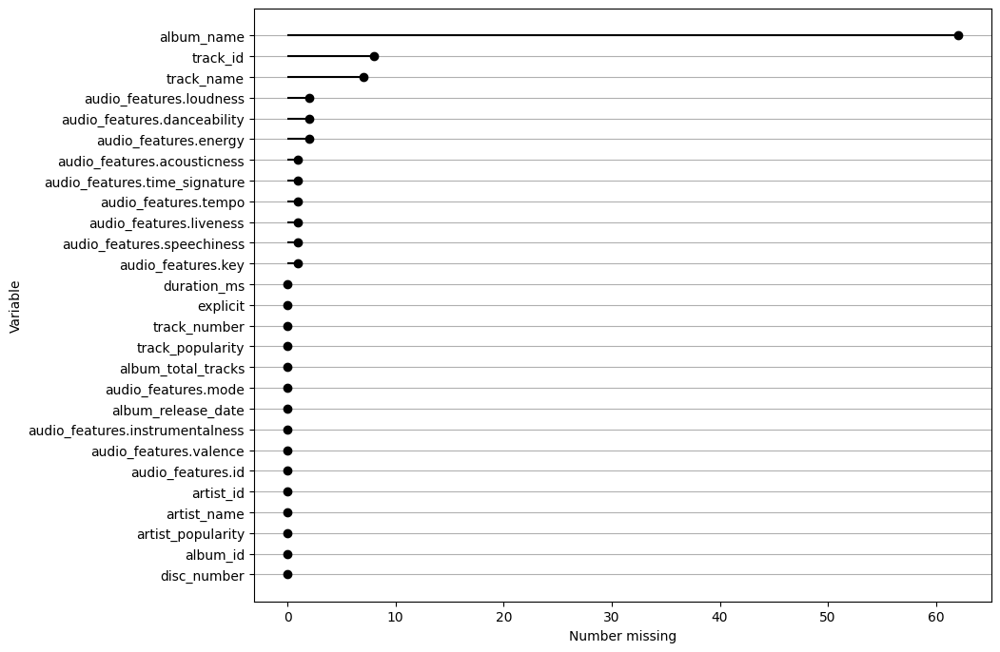
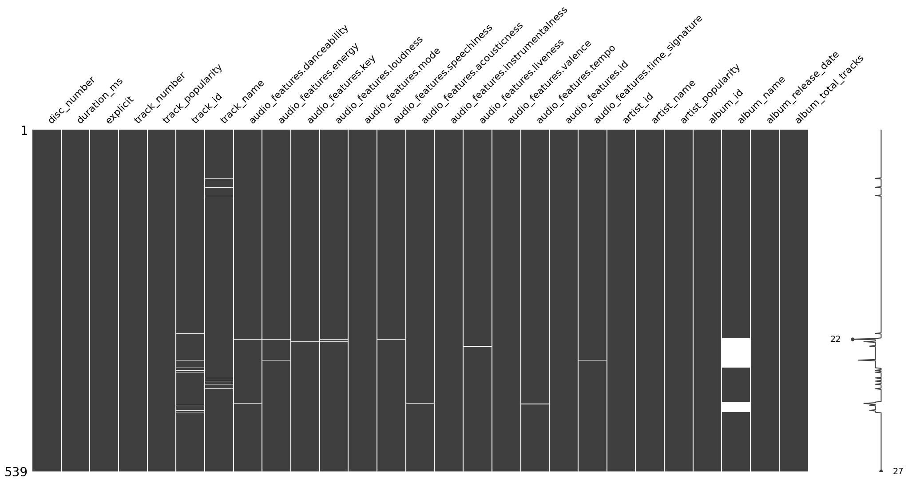
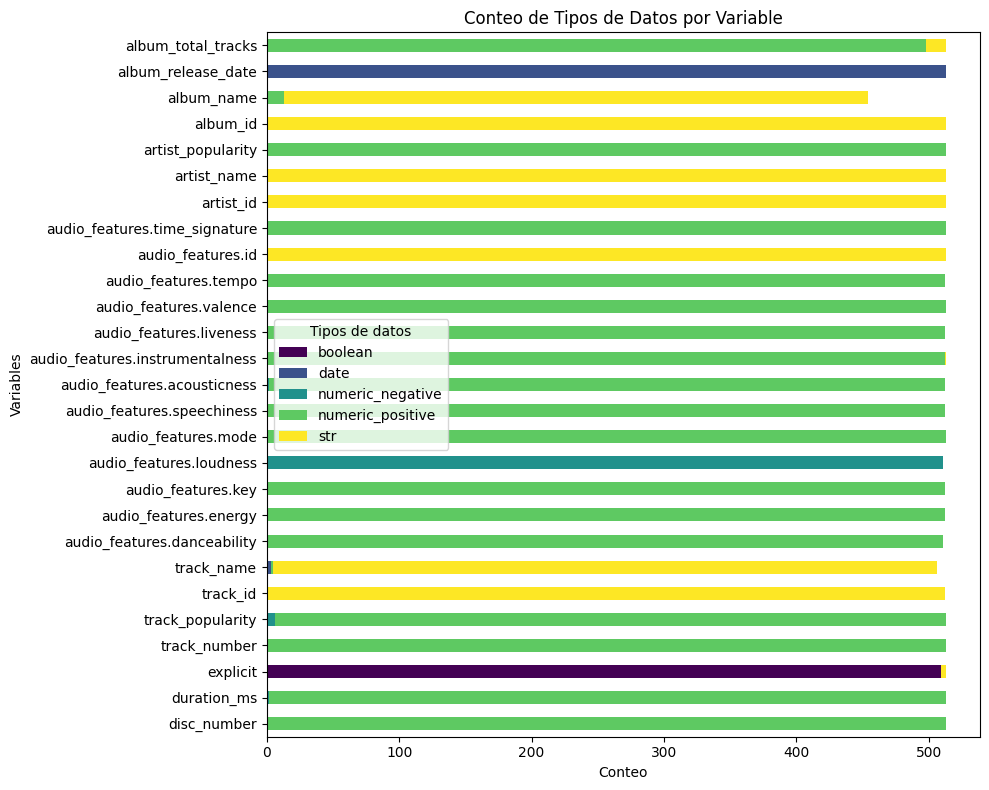
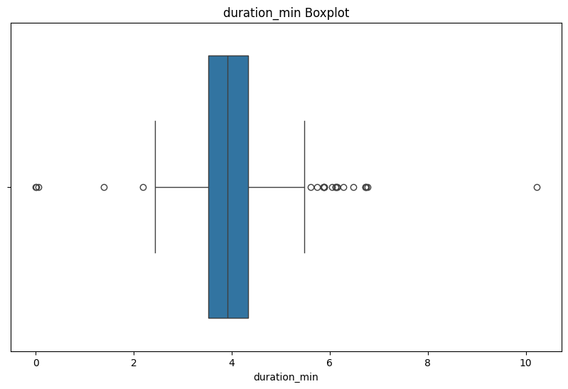

# Resumen - Análisis de Calidad de Datos

En este archivo se encuentra un resumen de todo lo expuesto en el [notebook de esta sección](main.ipynb).

## Tabla de contenidos
- [Resumen - Análisis de Calidad de Datos](#resumen---análisis-de-calidad-de-datos)
  - [Tabla de contenidos](#tabla-de-contenidos)
  - [1.0. Datos generales](#10-datos-generales)
  - [2.0. Completitud](#20-completitud)
    - [2.1. Deepdive - Columnas con más valores faltantes](#21-deepdive---columnas-con-más-valores-faltantes)
  - [3.0. Unicidad](#30-unicidad)
    - [3.1. Filas repetidas](#31-filas-repetidas)
    - [3.2. Track\_ids repetidos](#32-track_ids-repetidos)
      - [3.2.1. audio\_features.id repetidos](#321-audio_featuresid-repetidos)
    - [3.3. Consistencia llaves primarias](#33-consistencia-llaves-primarias)
    - [3.4. Porcentaje de Unicidad](#34-porcentaje-de-unicidad)
  - [4.0. Validez y Precisión](#40-validez-y-precisión)
    - [4.1. Tipos de datos](#41-tipos-de-datos)
    - [4.2. Validaciones](#42-validaciones)
      - [4.2.1. No se cumple con el tipo de dato](#421-no-se-cumple-con-el-tipo-de-dato)
      - [4.2.2. No se cumple que todos los valores sean positivos](#422-no-se-cumple-que-todos-los-valores-sean-positivos)
        - [4.2.2.1. duration\_ms](#4221-duration_ms)
        - [4.2.2.2. track\_popularity](#4222-track_popularity)
        - [4.2.2.3. audio\_features.acousticness](#4223-audio_featuresacousticness)
      - [4.2.3. Se cumplen Rangos para valores númericos?](#423-se-cumplen-rangos-para-valores-númericos)
        - [4.2.3.1. audio\_features.acousticness](#4231-audio_featuresacousticness)
        - [4.2.3.2. artist\_popularity](#4232-artist_popularity)
        - [4.2.3.3. Datos atípicos para duration\_ms](#4233-datos-atípicos-para-duration_ms)
      - [4.2.4. 'release\_date' hace sentido?](#424-release_date-hace-sentido)
      - [4.2.5. 'album\_total\_tracks' refleja el verdadero conteo de tracks del álbum?](#425-album_total_tracks-refleja-el-verdadero-conteo-de-tracks-del-álbum)


## 1.0. Datos generales
- El dataframe cuenta con 539 filas y 27 columnas
- Estas son las columnas: 
```
'disc_number', 'duration_ms', 'explicit', 'track_number',
'track_popularity', 'track_id', 'track_name',
'audio_features.danceability', 'audio_features.energy',
'audio_features.key', 'audio_features.loudness', 'audio_features.mode',
'audio_features.speechiness', 'audio_features.acousticness',
'audio_features.instrumentalness', 'audio_features.liveness',
'audio_features.valence', 'audio_features.tempo', 'audio_features.id',
'audio_features.time_signature', 'artist_id', 'artist_name',
'artist_popularity', 'album_id', 'album_name', 'album_release_date',
'album_total_tracks'
 ```

## 2.0. Completitud
En esta sección se validaron la cantidad de datos faltantes dentro de cada columna. Obtuviendo un porcentaje de completitud del **99.39%** a nivel dataset, que viene dado por la falta de valores en las siguientes columnas:

<p align="center">
  
  <br>
  <em>Ilustración 1. Gráfico de barras de valores faltantes</em>
</p>

Otra manera de verlo es por medio esta matriz de datos faltantes en donde el eje Y son cada una de las filas del dataset.

<p align="center">
  
  <br>
  <em>Ilustración 2. Matriz de valores faltantes</em>
</p>

### 2.1. Deepdive - Columnas con más valores faltantes

La columna que más valores falantes presenta es la de 'album_name'. Entraremos a analizar a qué puede deberse. Inicialmente algo curioso que se identificó es que la columna de 'album_id' *no* tiene datos faltantes. Al revisar a detalle encontramos que son solo 2 álbumes los que agrupan el conjunto de los 62 datos faltantes. Quedando de la siguiente manera:

| album_id                  | filas faltantes   |
| ------------              | ------------      |
| 1MPAXuTVL2Ej5x0JHiSPq8    | 46                |
| 6fyR4wBPwLHKcRtxgd4sGh    | 16                | 
| **Total**                 | **62**            |

También se validó que dichos album_ids no existan en otros registros donde sí tengan el album_name completo (de ser así podríamos arreglar estos datos faltantes de forma sencilla). Efectivamente no se econtraron registros de este estilo.

Revisando la documentación de la [API de Spotify](https://developer.spotify.com/documentation/web-api/reference/get-an-album) en la sección de 'Albums' se encuentra lo siguiente:

> The name of the album. In case of an album takedown, the value may be an empty string.

Una primera hipótesis es que podrían tratarse de dos álbumes que hayan sido borrados. Sin embargo al validar en la misma API se encontró que estos álbumes sí tienen nombres. Por tanto puede deberse a una falla en la respuesta o una alteración en el json de la prueba.

En cuanto al resto de casos con valores faltantes, estos pueden deberse también a lo ya mencionado. Sin embargo no representan un porcentaje singficativo sobre el total de la data. Por tanto y asumiendo que el porcentaje de completitud del dataframe va acorde a los lineamientos de la compañía, podemos dar por concluida esta sección afirmando que el dataframe cumple con ella.

## 3.0. Unicidad

En esta sección se revisó:
- Que no existan filas repetidas.
- Que no existan track_ids (nuestro nivel de granularidad más bajo) repetidos.
- Que no existan llaves primarias (ej: artist_id, album_id) que referencien datos diferentes.
- % de unicidad

### 3.1. Filas repetidas
Se encontraron 36 filas repetitas dentro de todo el dataset. Entendiendo como repetida todas aquellas filas que compartan exactamente los mismos atributos con una o más filas. Ejemplos:
| track_id               | track_name      | album_id               | album_name | audio_features.id       |
|------------------------|-----------------|------------------------|------------|-------------------------|
| 12M5uqx0ZuwkpLp5rJim1a | Cornelia Street | 1NAmidJlEaVgA3MpcPFYGq | Lover      | 12M5uqx0ZuwkpLp5rJim1a  |
| 12M5uqx0ZuwkpLp5rJim1a | Cornelia Street | 1NAmidJlEaVgA3MpcPFYGq | Lover      | 12M5uqx0ZuwkpLp5rJim1a  |
| 1LLXZFeAHK9R4xUramtUKw | London Boy      | 1NAmidJlEaVgA3MpcPFYGq | Lover      | 1LLXZFeAHK9R4xUramtUKw  |
| 1LLXZFeAHK9R4xUramtUKw | London Boy      | 1NAmidJlEaVgA3MpcPFYGq | Lover      | 1LLXZFeAHK9R4xUramtUKw  |

### 3.2. Track_ids repetidos
Existen 38 track_ids repetidos, provenientes de una duplicación de 19 track_ids que serían los originales. Ejemplos:
| track_id               | track_name            | album_id               | album_name | audio_features.id       |
|------------------------|-----------------------|------------------------|------------|-------------------------|
| 6RRNNciQGZEXnqk8SQ9yv5 | You Need To Calm Down | 1NAmidJlEaVgA3MpcPFYGq | Lover      | 6RRNNciQGZEXnqk8SQ9yv5  |
| 6RRNNciQGZEXnqk8SQ9yv5 | You Need To Calm Down | 1NAmidJlEaVgA3MpcPFYGq | Lover      | 6RRNNciQGZEXnqk8SQ9yv5  |
| 5hQSXkFgbxjZo9uCwd11so | False God             | 1NAmidJlEaVgA3MpcPFYGq | Lover      | 5hQSXkFgbxjZo9uCwd11so  |
| 5hQSXkFgbxjZo9uCwd11so | False God             | 1NAmidJlEaVgA3MpcPFYGq | Lover      | 

#### 3.2.1. audio_features.id repetidos
Ahora bien, si consideramos que cada track tiene un audio_features.id único, podríamos hacer el conteo de duplicados con este id para tener en consideración aquellos tracks_ids vacíos. Este conteo dio como resultado que hay 40 audio_features.id repetidos, provenientes de una duplicación de 20 track_ids que serían los originales. Por lo que el dataframe, eliminando estos 20 registros, quedaría de **519 filas**. Ejemplos:

| track_id               | track_name                 | album_id               | album_name | audio_features.id       |
|------------------------|----------------------------|------------------------|------------|-------------------------|
| 1LLXZFeAHK9R4xUramtUKw | London Boy                 | 1NAmidJlEaVgA3MpcPFYGq | Lover      | 1LLXZFeAHK9R4xUramtUKw  |
| 1LLXZFeAHK9R4xUramtUKw | London Boy                 | 1NAmidJlEaVgA3MpcPFYGq | Lover      | 1LLXZFeAHK9R4xUramtUKw  |
| 1SmiQ65iSAbPto6gPFlBYm | It’s Nice To Have A Friend | 1NAmidJlEaVgA3MpcPFYGq | Lover      | 1SmiQ65iSAbPto6gPFlBYm  |
| 1SmiQ65iSAbPto6gPFlBYm | It’s Nice To Have A Friend | 1NAmidJlEaVgA3MpcPFYGq | Lover      | 1SmiQ65iSAbPto6gPFlBYm  |


### 3.3. Consistencia llaves primarias
Aquí se validó que los siguientes pares de llaves no tuvieran inconsistencias dentro del dataset. Ejemplo: que el album_id 08CWGiv27MVQhYpuTtvx83 no tuviera más de un album_name (Fearless (International Version)) a lo largo de todas las filas. Estos fueron los pares evaluados
```python
key_pairs_compare = [
    ('album_id', 'album_name'), 
    ('album_name', 'album_id'),
    ('artist_id', 'artist_name'),
    ('artist_name', 'artist_id'),
    ('track_id', 'track_name'),
    ('track_name', 'track_id')
]
```

y solo se encontraron inconsistencias en el par ```('track_name', 'track_id')``` Donde hubo 306 tracks que tienen nombres repetidos entre sí. De esos 306 solo 128 son los nombres únicos. En otras palabras: hay 128 track_names que están repetidos al menos una vez. Aquí algunos ejemplos:

| track_id               | track_name                                  | album_id               | album_name                        |
|------------------------|---------------------------------------------|------------------------|-----------------------------------|
| 0CD7DzeCsuPJygddqlUVYa | "Slut!" (Taylor's Version) (From The Vault) | 1o59UpKw81iHR0HPiSkJR0 | 1989 (Taylor's Version) [Deluxe]  |
| 71BqAINEnezjQfxE4VuJfq | "Slut!" (Taylor's Version) (From The Vault) | 64LU4c1nfjz1t4VnGhagcg | 1989 (Taylor's Version)           |
| 3WC5CVAahvn98hiseoIvbw | 22                                          | 1KVKqWeRuXsJDLTW0VuD29 | Red (Deluxe Edition)              |
| 2P5gfMtCcKP0CkmgqFMyPg | 22                                          | 1MPAXuTVL2Ej5x0JHiSPq8 | NaN                               |
| ...                    | ...                                         | ...                    | ...                               |
| 0lx2cLdOt3piJbcaXIV74f | willow                                      | 2Xoteh7uEpea4TohMxjtaq | evermore                          |
| 2gVhfX2Gy1T9kDuS9azrF7 | willow                                      | 6AORtDjduMM3bupSWzbTSG | evermore (deluxe version)         |
| 6sQckd3Z8NPxVVKUnavY1F | ‘tis the damn season                        | 6AORtDjduMM3bupSWzbTSG | evermore (deluxe version)         |
| 7dW84mWkdWE5a6lFWxJCBG | ‘tis the damn season                        | 2Xoteh7uEpea4TohMxjtaq | evermo                            |

Es importante tener en cuenta que cada uno de estos tracks "repetidos" pertenecen a álbumes diferentes. Investigando un poco estos casos específicos, en su mayoría se deben a que Taylor Swift regrabó todos los tracks que tenía con su disquera anterior ([fuente](https://www.xataka.com/musica/nuevo-choque-taylor-swift-discograficas-contratos-cambian-para-evitar-que-otros-artistas-sigan-sus-pasos#:~:text=Cuando%20Taylor%20Swift%20anunci%C3%B3%20en,se%20entendi%C3%B3%20como%20una%20excentricidad.)) o a que son versiones "Deluxe" de la misma canción y pertenecen a otro(s) álbum(es).

**Nota:** las validaciones de X_name a X_id solo fueron realizadas para este caso específico. Pues dentro de todo el negocio podrían haber, por ejemplo, álbumes distintos con el mismo nombre. Así mismo para canciones y demás variables.

### 3.4. Porcentaje de Unicidad
- Evaluando la unicidad en base al track_id se obtuvo un valor de **94.99%**.
- Evaluando la unicidad en base al track_name se obtuvo un valor de **61.41%**.
- Evaluando la unicidad en base al audio_features.id se obtuvo un valor de **96.29%**.

## 4.0. Validez y Precisión
Aquí se validó que cada columna contenga tipos de datos consistentes. Los tipos de datos que validamos fueron:
- Numericos (int y float)
  - positivo
  - negativo
- Cadenas de texto
- Fechas
- Booleanos

También se tuvieron en cuenta otras validaciones lógicas del dataset.

### 4.1. Tipos de datos
Se validaron los tipos de datos presentes dentro de cada columna del dataset y se plasmó en este gráfico:

<p align="center">
  
  <br>
  <em>Ilustración 3. Gráfico de Tipos de Datos</em>
</p>

### 4.2. Validaciones

#### 4.2.1. No se cumple con el tipo de dato
- En la gráfica anterior resalta que en la columna 'album_total_tracks' la regla general es que los datos deberían ser númericos, sin embargo hay 15 casos donde esto no sucede y se debe a que en lugar de poner el número 13 se puso Thirteen.
- Adicionalmente también se identifica que en la columna explicit deberían haber en su mayoría valores booleanos (True o False), sin embargo hay 4 casos donde el valor está puesto como 'Si' (1) o 'No' (3)
  
#### 4.2.2. No se cumple que todos los valores sean positivos
Se identificaron tres columnas donde hay valores negativos que no tienen mucho sentido y se procede a validarlas:
- 'duration_ms'
- 'track_popularity'
- 'audio_features.acousticness'

'audio_features.loudness' es otra variable con valores negativos, sin embargo la documentación nos dice que este valor debe ir entre -60 y 0. Estas son todas las variables donde se obtuvo al menos 1 valor negativo:


| Variable                  | NaN | boolean | date | numeric_negative | numeric_positive | str |
|---------------------------|-----|---------|------|------------------|------------------|-----|
| duration_ms               | 0.0 | 0.0     | 0.0  | 2.0              | 517.0            | 0.0 |
| track_popularity          | 0.0 | 0.0     | 0.0  | 6.0              | 513.0            | 0.0 |
| audio_features.loudness   | 2.0 | 0.0     | 0.0  | 517.0            | 0.0              | 0.0 |
| audio_features.acousticness | 1.0 | 0.0     | 0.0  | 2.0              | 516.0            | 0.0 |

##### 4.2.2.1. duration_ms
En este caso se encontró que hay dos tracks que tienen una duración negativa, lo cual no tiene mucho sentido si hablamos de una medida de tiempo.
| track_id | track_name                               | duration_ms |
|----------|------------------------------------------|-------------|
| 4eTXfpHxhxVofrBUjAhPMg      | I Wish You Would - Voice Memo	                   | -107133     |
| 7gJtmLyPTwKzhGzMBXtuXH      | NaN                   | -223093     |


##### 4.2.2.2. track_popularity
Para esta variable sucede lo mismo que con la anterior. Se identificaron 6 casos con track_popularity negativa.
| track_id | track_name                      | track_popularity |
|----------|---------------------------------|------------------|
| 45R112Jz5hQeKgITXgSXzs       | Karma          | -69              |
| 4g2c7NoTWAOSYDy44l9nub       | Lavender Haze          | -70              |
| 5jQI2r1RdgtuT8S3iG8zFC      | Lavender Haze          | -85              |
| 0V3wPSX9ygBnCm8psDIegu      | Anti-Hero          | -92              |
| 0heeNYlwOGuUSe7TgUD27B      | Question...?          | -75              |
| 2r9CbjYgFhtAmcFv1cSquB      | I Almost Do (Taylor's Version)	          | -71              |


##### 4.2.2.3. audio_features.acousticness
Finalmente para audio_features.acousticness se encontraron 2 valores negativos cuando la documentación de la API dicen que deben ser valores entre el rango 0-1.
| track_id | track_name                                  | audio_features.acousticness |
|----------|---------------------------------------------|-----------------------------|
| 1OcSfkeCg9hRC2sFKB4IMJ        | Out Of The Woods (Taylor's Version)                      | -0.000537                   |
| 3FxJDucHWdw6caWTKO5b23        | I Wish You Would (Taylor's Version)	                       | -0.003540                   |


#### 4.2.3. Se cumplen Rangos para valores númericos?
Para esta validación se consultaron en la documentación de la API los rangos entre los que se debían encontrar 11 variables númericas del modelo (en su mayoría audio_features). Al realizar la validación todas dan casi al 100% dentro de los rangos y las que no es debido a valores faltantes y no a valores fuera de los rangos. Esto a excepción de dos variables: 'audio_features.acousticness' y 'artist_popularity'. Variables validadas:

```
track_popularity, artist_popularity, audio_features.danceability, audio_features.energy, 
audio_features.loudness, audio_features.speechiness, audio_features.acousticness, audio_features.instrumentalness, 
audio_features.liveness, audio_features.valence, audio_features.time_signature
```

##### 4.2.3.1. audio_features.acousticness
Adicional a las 2 entradas que fueron encontradas en el punto [4.2.2.3.](#4223-audio_featuresacousticness) se encontró que estos otros registros están fuera del rango (0, 1): 

| track_id             | track_name                                  | audio_features.acousticness |
|----------------------|---------------------------------------------|----------------------------|
| 0108kcWLnn2HlH2kedi1gn | Blank Space (Taylor's Version)             | 5.000000                   |
| 1OcSfkeCg9hRC2sFKB4IMJ | Out Of The Woods (Taylor's Version)        | -0.000537                  |
| 3FxJDucHWdw6caWTKO5b23 | I Wish You Would (Taylor's Version)        | -0.003540                  |
| 1oR4MUBpyNrAViC8wPNpfm | A Place in this World                      | 1.500000                   |
| 7CzxXgQXurKZCyHz9ufbo1 | I'm Only Me When I'm With You              | 2.000000                   |
| 72GIZuUXo14oyrS0si3Rgc | The Story Of Us - Live                     | NaN                        |

##### 4.2.3.2. artist_popularity
En esta variable se encontró que el 100% de los valores están errados, pues según la documentación de la API este valor debería oscilar entre 0-100 y en el caso del dataset el valor es de 120 para todas las filas (esto porque todas las canciones son de la misma artista).

##### 4.2.3.3. Datos atípicos para duration_ms
En este caso se validaron los casos atípicos en cuanto a duración de las canciones. Para esto:
- Se eliminaron los valores negativos que ya descartamos en el punto [4.2.2.1.](#4221-duration_ms)
- Se transformó la data a minutos para leerla de manera más sencilla

<p align="center">
  
  <br>
  <em>Ilustración 4. Boxplot Datos Atípicos - duration_min</em>
</p>

Con el método del rango intercuartilico se encontraron 23 datos atípicos. De estos 5 son de duraciones menores a 2.2 minutos y los 18 restantes de duraciones mayores 5.5 minutos. De estos 23 datos atípicos se encontró que solo 3 son valores incorrectos, el resto tienen una duración que, si bien no se encuentra dentro de las duraciones habituales de la artista, obedecen a la duración real de los tracks. Estos son los 3 tracks con duraciones incorrectas:

| track_id               | track_name             | album_id               | duration_ms | duration_min |
|------------------------|------------------------|------------------------|-------------|--------------|
| 5PjfMmF06QtxTPZBZHdhoZ | Everything Has Changed | 1KVKqWeRuXsJDLTW0VuD29 | 10          | 0.000167     |
| 7mFiEij8AXPUZB7aKLbUlQ | Mean - Live/2011       | 6fyR4wBPwLHKcRtxgd4sGh | 1000        | 0.016667     |
| 7BFc7ffruhZ4Hecnqf5xju | Long Live              | 6S6JQWzUrJVcJLK4fi74Fw | 3000        | 0.05         |


#### 4.2.4. 'release_date' hace sentido?
- Se validó que las fechas de release de las canciones sean menores o iguales al año actual (2023) [en producción podría validarse vs la fecha actual], ya que esta API solo nos retorna álbumes que ya fueron lanzados.
- En este caso específico también validaremos que los álbumes hayan sido lanzados desde el año en que Taylor Swift está activa en la música (2004) Ref: [Wikipedia](https://es.wikipedia.org/wiki/Taylor_Swift).

En este caso hay 38 casos de tracks donde no hace sentido el año de lanzamiento. 15 fueron lanzados antes del 2004 y 23 fueron "lanzados" posterior al 2023. Ejemplos:

| track_id               | track_name    | album_id               | album_name                       | album_release_date  |
|------------------------|---------------|------------------------|----------------------------------|---------------------|
| 24emu3sabKISjRkrys28jq | Lavender Haze | 1fnJ7k0bllNfL1kVdNVW1A | Midnights (The Til Dawn Edition) | 2027-05-26          |
| 6qxvy9Pe4RJIq5JBVbbwbS | Maroon        | 1fnJ7k0bllNfL1kVdNVW1A | Midnights (The Til Dawn Edition) | 2027-05-26          |
| 5qIHFdkW6phMsTZlN2g8Lc | Anti-Hero     | 1fnJ7k0bllNfL1kVdNVW1A | Midnights (The Til Dawn Edition) | 2027-05-26          |
| 0Jlcvv8IykzHaSmj49uNW8 | the 1                                       | 5eyZZoQEFQWRHkV2xgAeBw | Taylor Swift | 1989-10-24  |
| 4BYejINgfZF0qKDMEH2cim | Picture To Burn                             | 5eyZZoQEFQWRHkV2xgAeBw | Taylor Swift | 1989-10-24  |
| 2TF4UtYreqNbQ6Z9AccldU | Teardrops On My Guitar - Radio Single Remix | 5eyZZoQEFQWRHkV2xgAeBw | Taylor Swift | 1989-10-24  |

#### 4.2.5. 'album_total_tracks' refleja el verdadero conteo de tracks del álbum?
En esta sección se validó que al hacer un conteo manual de los tracks_ids por cada álbum, dicho valor coincidiera con el 'album_total_tracks' que es el valor que ya viene calculado por defecto para esta misma tarea. Estos fueron los casos donde esta validación falló:

| album_id               | manual_count | original_count | difference  |
|------------------------|--------------|----------------|-------------|
| 1fnJ7k0bllNfL1kVdNVW1A | 23           | 24             | -1          |
| 2Xoteh7uEpea4TohMxjtaq | 15           | 10             | 5           |
| 6kZ42qRrzov54LcAk4onW9 | 30           | 34             | -4          |

En este caso encontramos que hay 3 álbumes que tienen un conteo diferente al que se está mostrando. La precisión de álbumes con conteo acertado fue del 88%